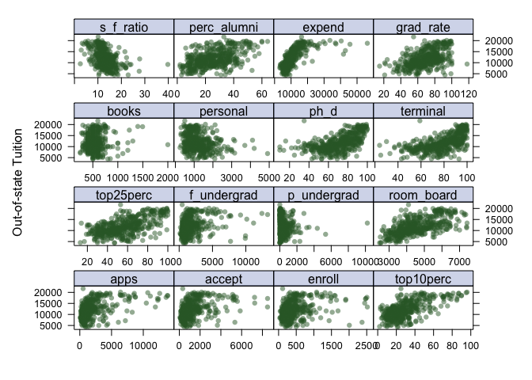
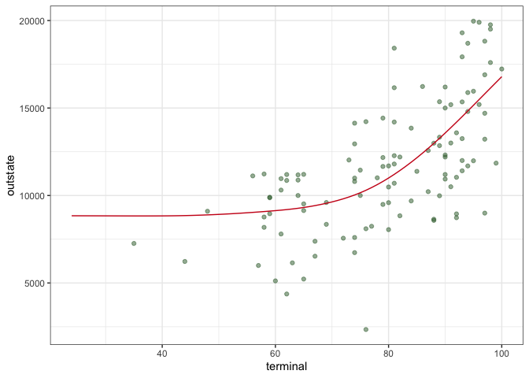
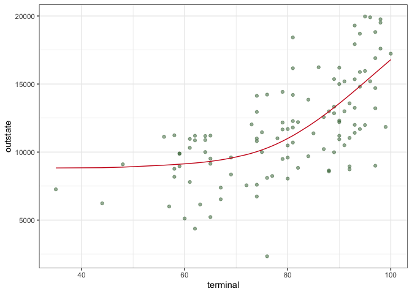
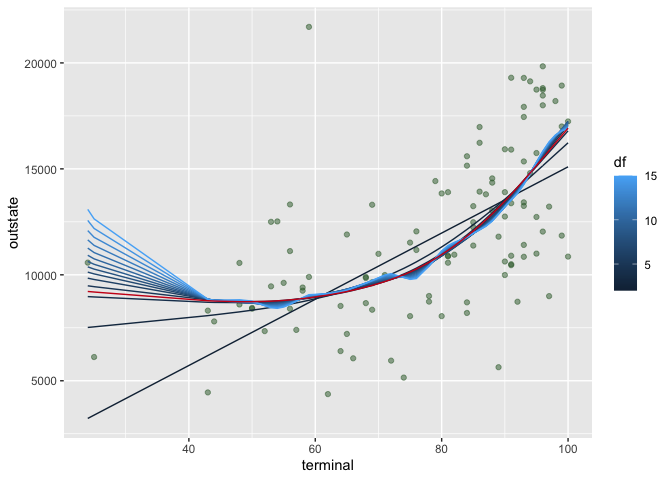
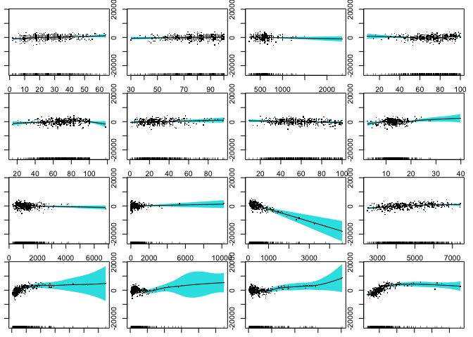

ds2_hw2
================
Ruilian Zhang
3/6/2022

``` r
# data cleaning
df = read_csv("College.csv") %>% 
  janitor::clean_names() %>% 
  select(-college) %>% 
  select(outstate, everything()) %>% 
  na.omit()
```

    ## Rows: 565 Columns: 18

    ## ── Column specification ────────────────────────────────────────────────────────
    ## Delimiter: ","
    ## chr  (1): College
    ## dbl (17): Apps, Accept, Enroll, Top10perc, Top25perc, F.Undergrad, P.Undergr...

    ## 
    ## ℹ Use `spec()` to retrieve the full column specification for this data.
    ## ℹ Specify the column types or set `show_col_types = FALSE` to quiet this message.

``` r
# data partition
indexTrain = createDataPartition(y = df$outstate,
                                 p = 0.8,
                                 list = FALSE)


train_df = df[indexTrain, ]
test_df = df[-indexTrain, ]

x_train = model.matrix(outstate ~ ., train_df)[ , -1]
y_train = train_df$outstate

x_test = model.matrix(outstate ~ ., test_df)[ , -1]
y_test = test_df$outstate
```

## Exploratory data analysis (using train_df)

``` r
# data dimension and summary
dim(train_df)
```

    ## [1] 453  17

``` r
summary(train_df)
```

    ##     outstate          apps           accept          enroll      
    ##  Min.   : 2340   Min.   :   81   Min.   :   72   Min.   :  35.0  
    ##  1st Qu.: 9100   1st Qu.:  604   1st Qu.:  485   1st Qu.: 198.0  
    ##  Median :11200   Median : 1110   Median :  838   Median : 324.0  
    ##  Mean   :11779   Mean   : 1900   Mean   : 1280   Mean   : 446.9  
    ##  3rd Qu.:13970   3rd Qu.: 2135   3rd Qu.: 1553   3rd Qu.: 511.0  
    ##  Max.   :21700   Max.   :20192   Max.   :13007   Max.   :4615.0  
    ##    top10perc       top25perc      f_undergrad     p_undergrad     
    ##  Min.   : 1.00   Min.   :  9.0   Min.   :  139   Min.   :    1.0  
    ##  1st Qu.:16.00   1st Qu.: 43.0   1st Qu.:  822   1st Qu.:   69.0  
    ##  Median :25.00   Median : 56.0   Median : 1271   Median :  216.0  
    ##  Mean   :29.25   Mean   : 57.2   Mean   : 1827   Mean   :  435.6  
    ##  3rd Qu.:36.00   3rd Qu.: 70.0   3rd Qu.: 1983   3rd Qu.:  538.0  
    ##  Max.   :96.00   Max.   :100.0   Max.   :27378   Max.   :10221.0  
    ##    room_board       books           personal         ph_d       
    ##  Min.   :2370   Min.   : 250.0   Min.   : 300   Min.   :  8.00  
    ##  1st Qu.:3736   1st Qu.: 450.0   1st Qu.: 800   1st Qu.: 60.00  
    ##  Median :4375   Median : 500.0   Median :1100   Median : 73.00  
    ##  Mean   :4569   Mean   : 545.3   Mean   :1212   Mean   : 70.84  
    ##  3rd Qu.:5340   3rd Qu.: 600.0   3rd Qu.:1500   3rd Qu.: 84.00  
    ##  Max.   :8124   Max.   :2340.0   Max.   :4913   Max.   :100.00  
    ##     terminal        s_f_ratio      perc_alumni        expend     
    ##  Min.   : 24.00   Min.   : 2.90   Min.   : 2.00   Min.   : 3480  
    ##  1st Qu.: 68.00   1st Qu.:11.10   1st Qu.:16.00   1st Qu.: 7477  
    ##  Median : 81.00   Median :12.70   Median :25.00   Median : 9006  
    ##  Mean   : 78.45   Mean   :13.04   Mean   :25.93   Mean   :10429  
    ##  3rd Qu.: 92.00   3rd Qu.:14.50   3rd Qu.:34.00   3rd Qu.:11291  
    ##  Max.   :100.00   Max.   :39.80   Max.   :64.00   Max.   :56233  
    ##    grad_rate     
    ##  Min.   : 18.00  
    ##  1st Qu.: 59.00  
    ##  Median : 70.00  
    ##  Mean   : 69.22  
    ##  3rd Qu.: 81.00  
    ##  Max.   :118.00

``` r
skimr::skim(train_df)
```

|                                                  |          |
|:-------------------------------------------------|:---------|
| Name                                             | train_df |
| Number of rows                                   | 453      |
| Number of columns                                | 17       |
| \_\_\_\_\_\_\_\_\_\_\_\_\_\_\_\_\_\_\_\_\_\_\_   |          |
| Column type frequency:                           |          |
| numeric                                          | 17       |
| \_\_\_\_\_\_\_\_\_\_\_\_\_\_\_\_\_\_\_\_\_\_\_\_ |          |
| Group variables                                  | None     |

Data summary

**Variable type: numeric**

| skim_variable | n_missing | complete_rate |     mean |      sd |     p0 |    p25 |     p50 |     p75 |    p100 | hist  |
|:--------------|----------:|--------------:|---------:|--------:|-------:|-------:|--------:|--------:|--------:|:------|
| outstate      |         0 |             1 | 11778.72 | 3636.44 | 2340.0 | 9100.0 | 11200.0 | 13970.0 | 21700.0 | ▁▆▇▃▂ |
| apps          |         0 |             1 |  1900.11 | 2368.92 |   81.0 |  604.0 |  1110.0 |  2135.0 | 20192.0 | ▇▁▁▁▁ |
| accept        |         0 |             1 |  1280.25 | 1375.00 |   72.0 |  485.0 |   838.0 |  1553.0 | 13007.0 | ▇▁▁▁▁ |
| enroll        |         0 |             1 |   446.90 |  457.83 |   35.0 |  198.0 |   324.0 |   511.0 |  4615.0 | ▇▁▁▁▁ |
| top10perc     |         0 |             1 |    29.25 |   17.51 |    1.0 |   16.0 |    25.0 |    36.0 |    96.0 | ▆▇▃▁▁ |
| top25perc     |         0 |             1 |    57.20 |   19.38 |    9.0 |   43.0 |    56.0 |    70.0 |   100.0 | ▁▆▇▅▃ |
| f_undergrad   |         0 |             1 |  1827.30 | 2109.70 |  139.0 |  822.0 |  1271.0 |  1983.0 | 27378.0 | ▇▁▁▁▁ |
| p_undergrad   |         0 |             1 |   435.63 |  732.64 |    1.0 |   69.0 |   216.0 |   538.0 | 10221.0 | ▇▁▁▁▁ |
| room_board    |         0 |             1 |  4569.20 | 1076.78 | 2370.0 | 3736.0 |  4375.0 |  5340.0 |  8124.0 | ▃▇▅▃▁ |
| books         |         0 |             1 |   545.30 |  177.00 |  250.0 |  450.0 |   500.0 |   600.0 |  2340.0 | ▇▁▁▁▁ |
| personal      |         0 |             1 |  1212.21 |  592.41 |  300.0 |  800.0 |  1100.0 |  1500.0 |  4913.0 | ▇▅▁▁▁ |
| ph_d          |         0 |             1 |    70.84 |   17.37 |    8.0 |   60.0 |    73.0 |    84.0 |   100.0 | ▁▁▅▇▆ |
| terminal      |         0 |             1 |    78.45 |   15.43 |   24.0 |   68.0 |    81.0 |    92.0 |   100.0 | ▁▁▃▆▇ |
| s_f\_ratio    |         0 |             1 |    13.04 |    3.58 |    2.9 |   11.1 |    12.7 |    14.5 |    39.8 | ▂▇▁▁▁ |
| perc_alumni   |         0 |             1 |    25.93 |   12.45 |    2.0 |   16.0 |    25.0 |    34.0 |    64.0 | ▅▇▇▂▁ |
| expend        |         0 |             1 | 10428.70 | 5640.67 | 3480.0 | 7477.0 |  9006.0 | 11291.0 | 56233.0 | ▇▁▁▁▁ |
| grad_rate     |         0 |             1 |    69.22 |   16.57 |   18.0 |   59.0 |    70.0 |    81.0 |   118.0 | ▁▃▇▅▁ |

There are 453 rows and 17 columns in training data, all the variables
are numeric.

``` r
# set plot theme
theme1 = trellis.par.get()
theme1$plot.symbol$col = rgb(.2, .4, .2, .5)
theme1$plot.symbol$pch = 16
theme1$plot.line$col = rgb(.8, .1, .1, 1)
theme1$plot.line$lwd = 2
theme1$strip.background$col = rgb(.0, .2, .6, .2)
trellis.par.set(theme1)

# scatter plot
# all predictors are included since they are all continuous
featurePlot(
  x_train, 
  y_train, 
  plot = "scatter", 
  labels = c("","Out-of-state Tuition"),
  layout = c(4, 4))
```

<!-- -->

From the scatter plot above, we can see that there might be some linear
trends between the outcome variable `outstate` and some of the
predictors, for example, `phd` and `terminal`.

## Smoothing splines

``` r
set.seed(2570)

# fit smoothing spline models using terminal as the only predictor of outstate 
fit_ss = smooth.spline(x = train_df$terminal, y = train_df$outstate)

# optimal degree of freedom obtained by generalized cross-validation
fit_ss$df
```

    ## [1] 4.259664

The optimal degree of freedom obtained by default cross validation is
4.26.

Use this **optimal degree of freedom** to make following predictions:

``` r
# make prediction using a grid of terminal values
# generate predictor grid
range(train_df$terminal)
```

    ## [1]  24 100

``` r
terminal_grid <- seq(from = 24, to = 100, by = 1)

# make prediction
pred_ss = predict(fit_ss,
                  x = terminal_grid)

pred_ss_df = data.frame(predicted = pred_ss$y,
                        terminal = terminal_grid)

# plot test data
p = ggplot(data = test_df, aes(x = terminal, y = outstate)) +
     geom_point(color = rgb(.2, .4, .2, .5))

# plot predicted value
p + 
  geom_line(aes(x = terminal, y = predicted), 
            data = pred_ss_df,
            color = rgb(.8, .1, .1, 1)) + 
  theme_bw()
```

<!-- -->

``` r
# make prediction using test data
pred_ss_test = predict(fit_ss,
                       x = test_df$terminal)

pred_ss_test_df = data.frame(predicted = pred_ss_test$y,
                             terminal = test_df$terminal)

# plot predicted value
p + 
  geom_line(aes(x = terminal, y = predicted), 
            data = pred_ss_test_df,
            color = rgb(.8, .1, .1, 1)) + 
  theme_bw()
```

<!-- -->

Use **a range of degree of freedom** to make predictions:

``` r
# write a function using a range of df to fit models
ss_func = function(df) {
  
  fit_ss_fun = smooth.spline(x = train_df$terminal, 
                                   y = train_df$outstate,
                                   df = df)
  
  pred_ss_fun = predict(fit_ss_fun, x = test_df$terminal)
  
  
  pred_ss_df_fun = data.frame(predicted = pred_ss_fun$y,
                         terminal = test_df$terminal,
                         df = df)
  
}

# create a list of df
# 1 < df <= 16 - 1
df_list = seq(2, 15, 1)

# run the function using df_list
output_ss = list()

for (x in df_list) {
  output_ss[[x]] = ss_func(x)
}

# do.call() executes a function by its name and a list of corresponding arguments
# e.g. do.call("any_function", arguments_list) 
output_ss_df = do.call("rbind", output_ss) %>% 
  as.data.frame()
```

``` r
# plot results for a range of df
p + 
  geom_line(aes(x = terminal, y = predicted, group = df, color = df), data = output_ss_df) + 
  geom_line(aes(x = terminal, y = predicted), data = pred_ss_test_df, color = rgb(.8, .1, .1, 1))
```

<!-- -->

The above plot shows the fitted smoothing spline models using a range of
degree of freedoms. The lines wiggle around the red line, which is the
model using the optimum degree of freedom.  
As the degree of freedom approaching to 2, the line gets more linear; as
the degree of freedom approaching to 15, the line gets more wiggled.  
Among all the fitted lines within the (2, 15) degree of freedom range,
df = 4.26 should be the nearest to the red line.

## Generalized Additive Model (GAM)

``` r
set.seed(2570)

# set cross validation method
ctrl = trainControl(method = "cv", number = 10)

# fit a GAM model using all the predictors
# ngcv package not available for current R version, siwth to caret
gam_fit = train(x = x_train,
                y = y_train,
                method = "gam",
                #tuneGrid = data.frame(method = "GCV.Cp",select = c(TRUE, FALSE)),
                trControl = ctrl)
```

    ## Loading required package: mgcv

    ## Loading required package: nlme

    ## 
    ## Attaching package: 'nlme'

    ## The following object is masked from 'package:dplyr':
    ## 
    ##     collapse

    ## This is mgcv 1.8-38. For overview type 'help("mgcv-package")'.

``` r
gam_fit$bestTune
```

    ##   select method
    ## 1  FALSE GCV.Cp

``` r
gam_fit$finalModel
```

    ## 
    ## Family: gaussian 
    ## Link function: identity 
    ## 
    ## Formula:
    ## .outcome ~ s(perc_alumni) + s(terminal) + s(books) + s(top10perc) + 
    ##     s(grad_rate) + s(ph_d) + s(top25perc) + s(s_f_ratio) + s(personal) + 
    ##     s(p_undergrad) + s(room_board) + s(enroll) + s(accept) + 
    ##     s(f_undergrad) + s(apps) + s(expend)
    ## 
    ## Estimated degrees of freedom:
    ## 1.91 1.00 1.50 8.25 4.26 5.18 1.23 
    ## 4.36 2.25 1.00 2.48 1.00 1.00 6.80 
    ## 1.00 6.02  total = 50.25 
    ## 
    ## GCV score: 2687719

``` r
summary(gam_fit)
```

    ## 
    ## Family: gaussian 
    ## Link function: identity 
    ## 
    ## Formula:
    ## .outcome ~ s(perc_alumni) + s(terminal) + s(books) + s(top10perc) + 
    ##     s(grad_rate) + s(ph_d) + s(top25perc) + s(s_f_ratio) + s(personal) + 
    ##     s(p_undergrad) + s(room_board) + s(enroll) + s(accept) + 
    ##     s(f_undergrad) + s(apps) + s(expend)
    ## 
    ## Parametric coefficients:
    ##             Estimate Std. Error t value Pr(>|t|)    
    ## (Intercept) 11778.72      72.63   162.2   <2e-16 ***
    ## ---
    ## Signif. codes:  0 '***' 0.001 '**' 0.01 '*' 0.05 '.' 0.1 ' ' 1
    ## 
    ## Approximate significance of smooth terms:
    ##                  edf Ref.df      F  p-value    
    ## s(perc_alumni) 1.910  2.419  6.649 0.000839 ***
    ## s(terminal)    1.000  1.000  0.692 0.406053    
    ## s(books)       1.499  1.832  0.624 0.420977    
    ## s(top10perc)   8.255  8.799  2.444 0.008651 ** 
    ## s(grad_rate)   4.260  5.295  3.064 0.008835 ** 
    ## s(ph_d)        5.183  6.256  1.508 0.200682    
    ## s(top25perc)   1.231  1.430  0.203 0.706215    
    ## s(s_f_ratio)   4.363  5.404  1.949 0.066256 .  
    ## s(personal)    2.251  2.841  2.539 0.086612 .  
    ## s(p_undergrad) 1.000  1.000  0.030 0.862101    
    ## s(room_board)  2.479  3.151 18.809  < 2e-16 ***
    ## s(enroll)      1.000  1.000 13.005 0.000350 ***
    ## s(accept)      1.000  1.000 17.992 2.82e-05 ***
    ## s(f_undergrad) 6.796  7.826  6.580  < 2e-16 ***
    ## s(apps)        1.000  1.000  5.426 0.020336 *  
    ## s(expend)      6.020  7.201 18.351  < 2e-16 ***
    ## ---
    ## Signif. codes:  0 '***' 0.001 '**' 0.01 '*' 0.05 '.' 0.1 ' ' 1
    ## 
    ## R-sq.(adj) =  0.819   Deviance explained = 83.9%
    ## GCV = 2.6877e+06  Scale est. = 2.3896e+06  n = 453

``` r
# plot the results
par(mar=c(1,1,1,1))
par(mfrow = c(4, 4))

plot(gam_fit$finalModel, 
     residuals = TRUE, 
     all.terms = TRUE, 
     shade = TRUE, 
     shade.col = 5)
```

<!-- -->

``` r
# train RMSE of final model
gam_train_rmse = sqrt(mean((y_train - predict(gam_fit)) ^ 2))
gam_train_rmse
```

    ## [1] 1457.587

``` r
# make predictions
gam_pred = predict(gam_fit, x_test)

# test RMSE of final model
gam_test_rmse = sqrt(mean(y_test - gam_pred) ^ 2)
gam_test_rmse
```

    ## [1] 54.51734

The training RMSE is1457.5865571 and the test RMSE is 54.5173396.
