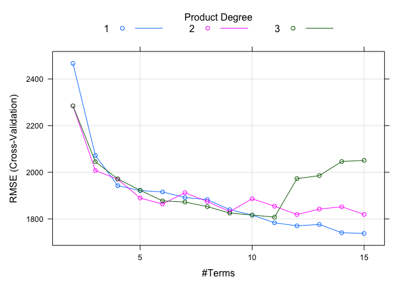
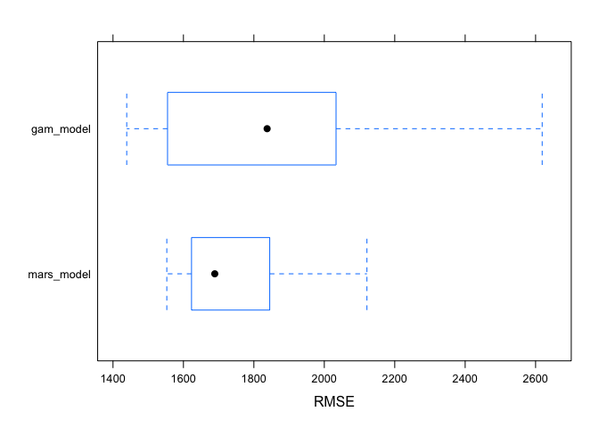

ds2_hw2
================
Ruilian Zhang
3/6/2022

``` r
# data cleaning
df = read_csv("College.csv") %>% 
  janitor::clean_names() %>% 
  select(-college) %>% 
  select(outstate, everything()) %>% 
  na.omit()
```

    ## Rows: 565 Columns: 18

    ## ── Column specification ────────────────────────────────────────────────────────
    ## Delimiter: ","
    ## chr  (1): College
    ## dbl (17): Apps, Accept, Enroll, Top10perc, Top25perc, F.Undergrad, P.Undergr...

    ## 
    ## ℹ Use `spec()` to retrieve the full column specification for this data.
    ## ℹ Specify the column types or set `show_col_types = FALSE` to quiet this message.

``` r
# data partition
indexTrain = createDataPartition(y = df$outstate,
                                 p = 0.8,
                                 list = FALSE)


train_df = df[indexTrain, ]
test_df = df[-indexTrain, ]

x_train = model.matrix(outstate ~ ., train_df)[ , -1]
y_train = train_df$outstate

x_test = model.matrix(outstate ~ ., test_df)[ , -1]
y_test = test_df$outstate
```

## Exploratory data analysis (using train_df)

``` r
# data dimension and summary
dim(train_df)
```

    ## [1] 453  17

``` r
summary(train_df)
```

    ##     outstate          apps           accept          enroll      
    ##  Min.   : 2340   Min.   :  141   Min.   :  118   Min.   :  46.0  
    ##  1st Qu.: 9100   1st Qu.:  604   1st Qu.:  494   1st Qu.: 199.0  
    ##  Median :11200   Median : 1110   Median :  847   Median : 324.0  
    ##  Mean   :11759   Mean   : 1986   Mean   : 1294   Mean   : 458.4  
    ##  3rd Qu.:13970   3rd Qu.: 2174   3rd Qu.: 1598   3rd Qu.: 526.0  
    ##  Max.   :20100   Max.   :20192   Max.   :13007   Max.   :4615.0  
    ##    top10perc      top25perc       f_undergrad     p_undergrad     
    ##  Min.   : 1.0   Min.   :  9.00   Min.   :  199   Min.   :    1.0  
    ##  1st Qu.:16.0   1st Qu.: 42.00   1st Qu.:  809   1st Qu.:   63.0  
    ##  Median :25.0   Median : 55.00   Median : 1238   Median :  208.0  
    ##  Mean   :29.3   Mean   : 56.83   Mean   : 1894   Mean   :  432.3  
    ##  3rd Qu.:36.0   3rd Qu.: 69.00   3rd Qu.: 1988   3rd Qu.:  513.0  
    ##  Max.   :96.0   Max.   :100.00   Max.   :27378   Max.   :10221.0  
    ##    room_board       books           personal         ph_d       
    ##  Min.   :2460   Min.   : 250.0   Min.   : 250   Min.   :  8.00  
    ##  1st Qu.:3740   1st Qu.: 450.0   1st Qu.: 800   1st Qu.: 60.00  
    ##  Median :4408   Median : 500.0   Median :1100   Median : 73.00  
    ##  Mean   :4600   Mean   : 546.1   Mean   :1227   Mean   : 71.02  
    ##  3rd Qu.:5400   3rd Qu.: 600.0   3rd Qu.:1500   3rd Qu.: 84.00  
    ##  Max.   :7425   Max.   :2340.0   Max.   :6800   Max.   :100.00  
    ##     terminal        s_f_ratio      perc_alumni     expend        grad_rate     
    ##  Min.   : 30.00   Min.   : 2.50   Min.   : 2   Min.   : 3186   Min.   : 15.00  
    ##  1st Qu.: 68.00   1st Qu.:11.20   1st Qu.:17   1st Qu.: 7477   1st Qu.: 58.00  
    ##  Median : 80.00   Median :12.70   Median :25   Median : 8861   Median : 70.00  
    ##  Mean   : 78.65   Mean   :12.94   Mean   :26   Mean   :10452   Mean   : 69.08  
    ##  3rd Qu.: 92.00   3rd Qu.:14.50   3rd Qu.:34   3rd Qu.:11561   3rd Qu.: 81.00  
    ##  Max.   :100.00   Max.   :39.80   Max.   :64   Max.   :56233   Max.   :118.00

``` r
skimr::skim(train_df)
```

|                                                  |          |
|:-------------------------------------------------|:---------|
| Name                                             | train_df |
| Number of rows                                   | 453      |
| Number of columns                                | 17       |
| \_\_\_\_\_\_\_\_\_\_\_\_\_\_\_\_\_\_\_\_\_\_\_   |          |
| Column type frequency:                           |          |
| numeric                                          | 17       |
| \_\_\_\_\_\_\_\_\_\_\_\_\_\_\_\_\_\_\_\_\_\_\_\_ |          |
| Group variables                                  | None     |

Data summary

**Variable type: numeric**

| skim_variable | n_missing | complete_rate |     mean |      sd |     p0 |    p25 |     p50 |     p75 |    p100 | hist  |
|:--------------|----------:|--------------:|---------:|--------:|-------:|-------:|--------:|--------:|--------:|:------|
| outstate      |         0 |             1 | 11759.19 | 3681.97 | 2340.0 | 9100.0 | 11200.0 | 13970.0 | 20100.0 | ▁▅▇▃▃ |
| apps          |         0 |             1 |  1985.92 | 2534.00 |  141.0 |  604.0 |  1110.0 |  2174.0 | 20192.0 | ▇▁▁▁▁ |
| accept        |         0 |             1 |  1294.36 | 1398.79 |  118.0 |  494.0 |   847.0 |  1598.0 | 13007.0 | ▇▁▁▁▁ |
| enroll        |         0 |             1 |   458.45 |  476.44 |   46.0 |  199.0 |   324.0 |   526.0 |  4615.0 | ▇▁▁▁▁ |
| top10perc     |         0 |             1 |    29.30 |   17.90 |    1.0 |   16.0 |    25.0 |    36.0 |    96.0 | ▇▇▃▁▁ |
| top25perc     |         0 |             1 |    56.83 |   19.42 |    9.0 |   42.0 |    55.0 |    69.0 |   100.0 | ▁▆▇▅▃ |
| f_undergrad   |         0 |             1 |  1894.27 | 2242.52 |  199.0 |  809.0 |  1238.0 |  1988.0 | 27378.0 | ▇▁▁▁▁ |
| p_undergrad   |         0 |             1 |   432.27 |  748.25 |    1.0 |   63.0 |   208.0 |   513.0 | 10221.0 | ▇▁▁▁▁ |
| room_board    |         0 |             1 |  4599.94 | 1080.76 | 2460.0 | 3740.0 |  4408.0 |  5400.0 |  7425.0 | ▃▇▅▃▁ |
| books         |         0 |             1 |   546.10 |  171.22 |  250.0 |  450.0 |   500.0 |   600.0 |  2340.0 | ▇▁▁▁▁ |
| personal      |         0 |             1 |  1227.16 |  654.82 |  250.0 |  800.0 |  1100.0 |  1500.0 |  6800.0 | ▇▂▁▁▁ |
| ph_d          |         0 |             1 |    71.02 |   16.90 |    8.0 |   60.0 |    73.0 |    84.0 |   100.0 | ▁▁▆▇▆ |
| terminal      |         0 |             1 |    78.65 |   14.98 |   30.0 |   68.0 |    80.0 |    92.0 |   100.0 | ▁▂▅▇▇ |
| s_f\_ratio    |         0 |             1 |    12.94 |    3.59 |    2.5 |   11.2 |    12.7 |    14.5 |    39.8 | ▂▇▁▁▁ |
| perc_alumni   |         0 |             1 |    26.00 |   12.17 |    2.0 |   17.0 |    25.0 |    34.0 |    64.0 | ▅▇▇▂▁ |
| expend        |         0 |             1 | 10452.41 | 5770.06 | 3186.0 | 7477.0 |  8861.0 | 11561.0 | 56233.0 | ▇▁▁▁▁ |
| grad_rate     |         0 |             1 |    69.08 |   16.72 |   15.0 |   58.0 |    70.0 |    81.0 |   118.0 | ▁▃▇▆▁ |

There are 453 rows and 17 columns in training data, all the variables
are numeric.

``` r
# set plot theme
theme1 = trellis.par.get()
theme1$plot.symbol$col = rgb(.2, .4, .2, .5)
theme1$plot.symbol$pch = 16
theme1$plot.line$col = rgb(.8, .1, .1, 1)
theme1$plot.line$lwd = 2
theme1$strip.background$col = rgb(.0, .2, .6, .2)
trellis.par.set(theme1)

# scatter plot
# all predictors are included since they are all continuous
featurePlot(
  x_train, 
  y_train, 
  plot = "scatter", 
  labels = c("","Out-of-state Tuition"),
  layout = c(4, 4))
```

<!-- -->

From the scatter plot above, we can see that there might be some linear
trends between the outcome variable `outstate` and some of the
predictors, for example, `phd` and `terminal`.

## Smoothing splines

``` r
set.seed(2570)

# fit smoothing spline models using terminal as the only predictor of outstate 
fit_ss = smooth.spline(x = train_df$terminal, y = train_df$outstate)

# optimal degree of freedom obtained by generalized cross-validation
fit_ss$df
```

    ## [1] 4.409315

The optimal degree of freedom obtained by default cross validation is
4.409.

Use this **optimal degree of freedom** to make following predictions:

``` r
# make prediction using a grid of terminal values
# generate predictor grid
range(train_df$terminal)
```

    ## [1]  30 100

``` r
terminal_grid <- seq(from = 24, to = 100, by = 1)

# make prediction
pred_ss = predict(fit_ss,
                  x = terminal_grid)

pred_ss_df = data.frame(predicted = pred_ss$y,
                        terminal = terminal_grid)

# plot test data
p = ggplot(data = test_df, aes(x = terminal, y = outstate)) +
     geom_point(color = rgb(.2, .4, .2, .5))

# plot predicted value
p + 
  geom_line(aes(x = terminal, y = predicted), 
            data = pred_ss_df,
            color = rgb(.8, .1, .1, 1)) + 
  theme_bw()
```

<!-- -->

``` r
# make prediction using test data
pred_ss_test = predict(fit_ss,
                       x = test_df$terminal)

pred_ss_test_df = data.frame(predicted = pred_ss_test$y,
                             terminal = test_df$terminal)

# plot predicted value
p + 
  geom_line(aes(x = terminal, y = predicted), 
            data = pred_ss_test_df,
            color = rgb(.8, .1, .1, 1)) + 
  theme_bw()
```

<!-- -->

Use **a range of degree of freedom** to make predictions:

``` r
# write a function using a range of df to fit models
ss_func = function(df) {
  
  fit_ss_fun = smooth.spline(x = train_df$terminal, 
                                   y = train_df$outstate,
                                   df = df)
  
  pred_ss_fun = predict(fit_ss_fun, x = test_df$terminal)
  
  
  pred_ss_df_fun = data.frame(predicted = pred_ss_fun$y,
                         terminal = test_df$terminal,
                         df = df)
  
}

# create a list of df
# 1 < df <= 16 - 1
df_list = seq(2, 15, 1)

# run the function using df_list
output_ss = list()

for (x in df_list) {
  output_ss[[x]] = ss_func(x)
}

# do.call() executes a function by its name and a list of corresponding arguments
# e.g. do.call("any_function", arguments_list) 
output_ss_df = do.call("rbind", output_ss) %>% 
  as.data.frame()
```

``` r
# plot results for a range of df
p + 
  geom_line(aes(x = terminal, y = predicted, group = df, color = df), data = output_ss_df) + 
  geom_line(aes(x = terminal, y = predicted), data = pred_ss_test_df, color = rgb(.8, .1, .1, 1))
```

<!-- -->

The above plot shows the fitted smoothing spline models using a range of
degree of freedoms. The lines wiggle around the red line, which is the
model using the optimum degree of freedom.  
As the degree of freedom approaching to 2, the line gets more linear; as
the degree of freedom approaching to 15, the line gets more wiggled.  
Among all the fitted lines within the (2, 15) degree of freedom range,
df = 4.409 should be the nearest to the red line.

## Generalized Additive Model (GAM)

``` r
set.seed(2570)

# set cross validation method
ctrl = trainControl(method = "cv", number = 10)

# fit a GAM model using all the predictors
# ngcv package not available for current R version, siwth to caret
gam_fit = train(x = x_train,
                y = y_train,
                method = "gam",
                #tuneGrid = data.frame(method = "GCV.Cp",select = c(TRUE, FALSE)),
                trControl = ctrl)
```

    ## Loading required package: mgcv

    ## Loading required package: nlme

    ## 
    ## Attaching package: 'nlme'

    ## The following object is masked from 'package:dplyr':
    ## 
    ##     collapse

    ## This is mgcv 1.8-38. For overview type 'help("mgcv-package")'.

``` r
gam_fit$bestTune
```

    ##   select method
    ## 1  FALSE GCV.Cp

``` r
gam_fit$finalModel
```

    ## 
    ## Family: gaussian 
    ## Link function: identity 
    ## 
    ## Formula:
    ## .outcome ~ s(perc_alumni) + s(terminal) + s(books) + s(ph_d) + 
    ##     s(grad_rate) + s(top10perc) + s(top25perc) + s(s_f_ratio) + 
    ##     s(personal) + s(p_undergrad) + s(enroll) + s(room_board) + 
    ##     s(accept) + s(f_undergrad) + s(apps) + s(expend)
    ## 
    ## Estimated degrees of freedom:
    ## 2.41 1.00 1.00 2.89 4.26 1.00 1.01 
    ## 4.22 1.00 1.00 1.00 2.19 4.12 5.95 
    ## 5.95 4.78  total = 44.78 
    ## 
    ## GCV score: 2619696

``` r
summary(gam_fit)
```

    ## 
    ## Family: gaussian 
    ## Link function: identity 
    ## 
    ## Formula:
    ## .outcome ~ s(perc_alumni) + s(terminal) + s(books) + s(ph_d) + 
    ##     s(grad_rate) + s(top10perc) + s(top25perc) + s(s_f_ratio) + 
    ##     s(personal) + s(p_undergrad) + s(enroll) + s(room_board) + 
    ##     s(accept) + s(f_undergrad) + s(apps) + s(expend)
    ## 
    ## Parametric coefficients:
    ##             Estimate Std. Error t value Pr(>|t|)    
    ## (Intercept) 11759.19      72.19   162.9   <2e-16 ***
    ## ---
    ## Signif. codes:  0 '***' 0.001 '**' 0.01 '*' 0.05 '.' 0.1 ' ' 1
    ## 
    ## Approximate significance of smooth terms:
    ##                  edf Ref.df      F  p-value    
    ## s(perc_alumni) 2.408  3.060  5.761 0.000679 ***
    ## s(terminal)    1.000  1.000  1.452 0.228894    
    ## s(books)       1.000  1.000  1.260 0.262374    
    ## s(ph_d)        2.891  3.675  3.937 0.005893 ** 
    ## s(grad_rate)   4.262  5.294  3.500 0.003638 ** 
    ## s(top10perc)   1.000  1.000  1.432 0.232162    
    ## s(top25perc)   1.015  1.029  1.775 0.180662    
    ## s(s_f_ratio)   4.216  5.228  2.484 0.030666 *  
    ## s(personal)    1.000  1.000  2.498 0.114721    
    ## s(p_undergrad) 1.000  1.000  0.816 0.366802    
    ## s(enroll)      1.000  1.000 24.553 1.21e-06 ***
    ## s(room_board)  2.195  2.781 14.058  < 2e-16 ***
    ## s(accept)      4.118  5.072  3.876 0.001854 ** 
    ## s(f_undergrad) 5.948  6.977  3.292 0.001814 ** 
    ## s(apps)        5.951  7.020  2.538 0.013790 *  
    ## s(expend)      4.778  5.867 22.670  < 2e-16 ***
    ## ---
    ## Signif. codes:  0 '***' 0.001 '**' 0.01 '*' 0.05 '.' 0.1 ' ' 1
    ## 
    ## R-sq.(adj) =  0.826   Deviance explained = 84.3%
    ## GCV = 2.6197e+06  Scale est. = 2.3607e+06  n = 453

``` r
# plot the results
par(mar=c(1,1,1,1))
par(mfrow = c(4, 4))

plot(gam_fit$finalModel, 
     residuals = TRUE, 
     all.terms = TRUE, 
     shade = TRUE, 
     shade.col = 5)
```

<!-- -->

``` r
# train RMSE of final model
gam_train_rmse = sqrt(mean((y_train - predict(gam_fit)) ^ 2))
gam_train_rmse
```

    ## [1] 1458.543

``` r
# make predictions
gam_pred = predict(gam_fit, x_test)

# test RMSE of final model
gam_test_rmse = sqrt(mean(y_test - gam_pred) ^ 2)
gam_test_rmse
```

    ## [1] 96.83349

The training RMSE is1458.5428454 and the test RMSE is 96.8334857.  
Coefficients are not printed for smooth terms because each smooth term
has several coefficients corresponding to different basis functions. The
degrees of freedom of each term represent the complexity of the smooth
function.  
In the final model, `perc_alumni`, `grad_rate`, `room_board`, `enroll`,
`accept`, `f_undergrad`, and `expend` are the most significant terms.

## Multivariate Adaptive Regression spline (MARS)

``` r
set.seed(2570)

# generate all possible combinations of degree and prune
mars_grid = expand.grid(degree = 1:3,
                        nprune = 2:15)

# fit MARS model using all predictors
mars_fit = train(x = x_train,
                 y = y_train,
                 method = "earth",
                 tuneGrid = mars_grid,
                 trControl = ctrl)
```

    ## Loading required package: earth

    ## Loading required package: Formula

    ## Loading required package: plotmo

    ## Loading required package: plotrix

    ## Loading required package: TeachingDemos

``` r
# plot results
plot(mars_fit)
```

<!-- -->

``` r
mars_fit$bestTune
```

    ##    nprune degree
    ## 14     15      1

``` r
summary(mars_fit$finalModel)
```

    ## Call: earth(x=matrix[453,16], y=c(7440,12280,11...), keepxy=TRUE, degree=1,
    ##             nprune=15)
    ## 
    ##                     coefficients
    ## (Intercept)            8862.1334
    ## h(3877-apps)              0.4294
    ## h(apps-3877)              0.3779
    ## h(2273-accept)           -2.5103
    ## h(accept-2273)            0.3505
    ## h(936-enroll)             6.5004
    ## h(enroll-936)            -2.3755
    ## h(1247-f_undergrad)      -2.1383
    ## h(5700-room_board)       -0.7332
    ## h(ph_d-79)               75.6259
    ## h(16-perc_alumni)       -82.6987
    ## h(perc_alumni-16)        31.3641
    ## h(expend-5524)            0.6153
    ## h(expend-15605)          -0.6210
    ## h(85-grad_rate)         -21.2306
    ## 
    ## Selected 15 of 28 terms, and 9 of 16 predictors (nprune=15)
    ## Termination condition: Reached nk 33
    ## Importance: expend, grad_rate, accept, enroll, room_board, f_undergrad, ...
    ## Number of terms at each degree of interaction: 1 14 (additive model)
    ## GCV 2652830    RSS 1052792851    GRSq 0.8047504    RSq 0.8281914

``` r
coef(mars_fit$finalModel)
```

    ##         (Intercept)     h(expend-15605)     h(85-grad_rate)  h(5700-room_board) 
    ##        8862.1334410          -0.6210382         -21.2305549          -0.7332138 
    ## h(1247-f_undergrad)   h(perc_alumni-16)   h(16-perc_alumni)          h(ph_d-79) 
    ##          -2.1383206          31.3640575         -82.6986549          75.6258608 
    ##        h(apps-3877)        h(3877-apps)       h(enroll-936)       h(936-enroll) 
    ##           0.3778537           0.4293645          -2.3755297           6.5004447 
    ##      h(accept-2273)      h(2273-accept)      h(expend-5524) 
    ##           0.3504814          -2.5102855           0.6152866

``` r
# train RMSE of final model
mars_train_rmse = sqrt(mean((y_train - predict(mars_fit)) ^ 2))
mars_train_rmse
```

    ## [1] 1524.482

``` r
# make predictions
mars_pred = predict(mars_fit, x_test)

# test RMSE of final model
mars_test_rmse = sqrt(mean(y_test - gam_pred) ^ 2)
mars_test_rmse
```

    ## [1] 96.83349

The training RMSE is1524.4822165 and the test RMSE is 96.8334857.  
The final model’s maximum degree of interactions is 1, which means the
final model is an additive model. `nprune` is 13, which means there are
13 terms in the final model, including intercept.  
The most important terms in the final model are `expend`, `room_board`,
`perc_alumni`, `accept`, and `enroll`.

``` r
# partial dependence plot
# use `books` as predictor
pdp = pdp::partial(mars_fit,
                   pred.var = c("enroll"),
                   grid.resolution = 20) %>% 
  autoplot()

# use `books` and `expend` as predictors

pdp_2d = pdp::partial(mars_fit,
                      pred.var = c("enroll", "expend"),
                      grid.resolution = 20) %>% 
  pdp::plotPartial(levelplot = FALSE,
                   zlab = "yhat",
                   drape = TRUE,
                   screen = list(z = 20, x = -60))

# grid.arrange(pdp, pdp_2d, n_col = 2)
```

Within the range of approximately less than 1000, we can see a trend of
decrease on the response variable when as `enroll` increases, and the
value of response variable stays stable afterwards. This turning point
is the knot.

## Model selection

``` r
resamp = resamples(list(gam_model = gam_fit,
                        mars_model = mars_fit))

summary(resamp)
```

    ## 
    ## Call:
    ## summary.resamples(object = resamp)
    ## 
    ## Models: gam_model, mars_model 
    ## Number of resamples: 10 
    ## 
    ## MAE 
    ##                Min.  1st Qu.   Median     Mean  3rd Qu.     Max. NA's
    ## gam_model  1120.944 1257.057 1408.354 1420.179 1579.319 1699.962    0
    ## mars_model 1128.511 1280.281 1374.423 1373.304 1463.350 1662.930    0
    ## 
    ## RMSE 
    ##                Min.  1st Qu.   Median     Mean  3rd Qu.     Max. NA's
    ## gam_model  1438.961 1568.806 1837.636 1852.121 2026.242 2618.682    0
    ## mars_model 1552.783 1629.634 1688.984 1737.655 1822.567 2121.045    0
    ## 
    ## Rsquared 
    ##                 Min.   1st Qu.    Median      Mean   3rd Qu.      Max. NA's
    ## gam_model  0.6498497 0.7110950 0.7820619 0.7627410 0.8124408 0.8430152    0
    ## mars_model 0.7093818 0.7820463 0.7925944 0.7883503 0.8076978 0.8251874    0

``` r
bwplot(resamp, metric = "RMSE")
```

<!-- -->

In this data example, we might prefer the use of MARS model over linear
model when predicting the out-of-state tuition, since the RMSE of MARS
model is smaller, which indicates the MARS model fits the data better.
