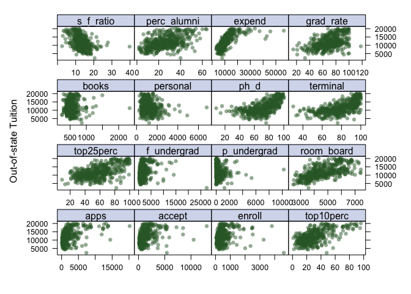
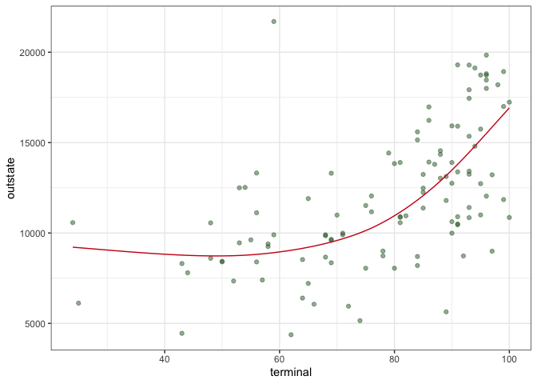

ds2_hw2
================
Ruilian Zhang
3/6/2022

``` r
# data cleaning
df = read_csv("College.csv") %>% 
  janitor::clean_names() %>% 
  select(-college) %>% 
  select(outstate, everything()) %>% 
  na.omit()
```

    ## Rows: 565 Columns: 18

    ## ── Column specification ────────────────────────────────────────────────────────
    ## Delimiter: ","
    ## chr  (1): College
    ## dbl (17): Apps, Accept, Enroll, Top10perc, Top25perc, F.Undergrad, P.Undergr...

    ## 
    ## ℹ Use `spec()` to retrieve the full column specification for this data.
    ## ℹ Specify the column types or set `show_col_types = FALSE` to quiet this message.

``` r
# data partition
indexTrain = createDataPartition(y = df$outstate,
                                 p = 0.8,
                                 list = FALSE)


train_df = df[indexTrain, ]
test_df = df[-indexTrain, ]

x_train = model.matrix(outstate ~ ., train_df)[ , -1]
y_train = train_df$outstate

x_test = model.matrix(outstate ~ ., test_df)[ , -1]
y_test = test_df$outstate
```

## Exploratory data analysis (using train_df)

``` r
# data dimension and summary
dim(train_df)
```

    ## [1] 453  17

``` r
summary(train_df)
```

    ##     outstate          apps           accept         enroll       top10perc 
    ##  Min.   : 4400   Min.   :   81   Min.   :  72   Min.   :  35   Min.   : 2  
    ##  1st Qu.: 9100   1st Qu.:  608   1st Qu.: 497   1st Qu.: 204   1st Qu.:16  
    ##  Median :11200   Median : 1107   Median : 849   Median : 324   Median :25  
    ##  Mean   :11830   Mean   : 1941   Mean   :1271   Mean   : 443   Mean   :29  
    ##  3rd Qu.:13970   3rd Qu.: 2153   3rd Qu.:1553   3rd Qu.: 509   3rd Qu.:36  
    ##  Max.   :21700   Max.   :13865   Max.   :8498   Max.   :2517   Max.   :96  
    ##    top25perc      f_undergrad     p_undergrad        room_board  
    ##  Min.   : 13.0   Min.   :  139   Min.   :    1.0   Min.   :2460  
    ##  1st Qu.: 42.0   1st Qu.:  846   1st Qu.:   63.0   1st Qu.:3710  
    ##  Median : 55.0   Median : 1241   Median :  211.0   Median :4400  
    ##  Mean   : 56.5   Mean   : 1821   Mean   :  428.7   Mean   :4567  
    ##  3rd Qu.: 69.0   3rd Qu.: 1988   3rd Qu.:  526.0   3rd Qu.:5400  
    ##  Max.   :100.0   Max.   :13259   Max.   :10221.0   Max.   :7425  
    ##      books           personal         ph_d           terminal     
    ##  Min.   : 250.0   Min.   : 250   Min.   : 10.00   Min.   : 24.00  
    ##  1st Qu.: 450.0   1st Qu.: 800   1st Qu.: 60.00   1st Qu.: 68.00  
    ##  Median : 500.0   Median :1100   Median : 73.00   Median : 80.00  
    ##  Mean   : 543.4   Mean   :1221   Mean   : 70.74   Mean   : 78.26  
    ##  3rd Qu.: 600.0   3rd Qu.:1500   3rd Qu.: 85.00   3rd Qu.: 92.00  
    ##  Max.   :2000.0   Max.   :4913   Max.   :100.00   Max.   :100.00  
    ##    s_f_ratio      perc_alumni        expend        grad_rate     
    ##  Min.   : 2.50   Min.   : 2.00   Min.   : 3186   Min.   : 15.00  
    ##  1st Qu.:11.10   1st Qu.:16.00   1st Qu.: 7356   1st Qu.: 58.00  
    ##  Median :12.70   Median :25.00   Median : 8953   Median : 69.00  
    ##  Mean   :12.93   Mean   :25.83   Mean   :10590   Mean   : 68.67  
    ##  3rd Qu.:14.50   3rd Qu.:34.00   3rd Qu.:11677   3rd Qu.: 81.00  
    ##  Max.   :39.80   Max.   :64.00   Max.   :56233   Max.   :118.00

``` r
skimr::skim(train_df)
```

|                                                  |          |
|:-------------------------------------------------|:---------|
| Name                                             | train_df |
| Number of rows                                   | 453      |
| Number of columns                                | 17       |
| \_\_\_\_\_\_\_\_\_\_\_\_\_\_\_\_\_\_\_\_\_\_\_   |          |
| Column type frequency:                           |          |
| numeric                                          | 17       |
| \_\_\_\_\_\_\_\_\_\_\_\_\_\_\_\_\_\_\_\_\_\_\_\_ |          |
| Group variables                                  | None     |

Data summary

**Variable type: numeric**

| skim_variable | n_missing | complete_rate |     mean |      sd |     p0 |    p25 |     p50 |     p75 |    p100 | hist  |
|:--------------|----------:|--------------:|---------:|--------:|-------:|-------:|--------:|--------:|--------:|:------|
| outstate      |         0 |             1 | 11829.55 | 3725.90 | 4400.0 | 9100.0 | 11200.0 | 13970.0 | 21700.0 | ▃▇▆▃▂ |
| apps          |         0 |             1 |  1941.43 | 2335.76 |   81.0 |  608.0 |  1107.0 |  2153.0 | 13865.0 | ▇▁▁▁▁ |
| accept        |         0 |             1 |  1270.72 | 1247.65 |   72.0 |  497.0 |   849.0 |  1553.0 |  8498.0 | ▇▂▁▁▁ |
| enroll        |         0 |             1 |   443.02 |  400.73 |   35.0 |  204.0 |   324.0 |   509.0 |  2517.0 | ▇▂▁▁▁ |
| top10perc     |         0 |             1 |    29.00 |   17.97 |    2.0 |   16.0 |    25.0 |    36.0 |    96.0 | ▇▇▃▁▁ |
| top25perc     |         0 |             1 |    56.50 |   19.66 |   13.0 |   42.0 |    55.0 |    69.0 |   100.0 | ▂▆▇▅▃ |
| f_undergrad   |         0 |             1 |  1821.20 | 1756.47 |  139.0 |  846.0 |  1241.0 |  1988.0 | 13259.0 | ▇▁▁▁▁ |
| p_undergrad   |         0 |             1 |   428.73 |  739.30 |    1.0 |   63.0 |   211.0 |   526.0 | 10221.0 | ▇▁▁▁▁ |
| room_board    |         0 |             1 |  4566.72 | 1089.86 | 2460.0 | 3710.0 |  4400.0 |  5400.0 |  7425.0 | ▃▇▅▃▁ |
| books         |         0 |             1 |   543.41 |  165.01 |  250.0 |  450.0 |   500.0 |   600.0 |  2000.0 | ▇▂▁▁▁ |
| personal      |         0 |             1 |  1220.52 |  608.20 |  250.0 |  800.0 |  1100.0 |  1500.0 |  4913.0 | ▇▅▁▁▁ |
| ph_d          |         0 |             1 |    70.74 |   17.54 |   10.0 |   60.0 |    73.0 |    85.0 |   100.0 | ▁▂▅▇▆ |
| terminal      |         0 |             1 |    78.26 |   15.77 |   24.0 |   68.0 |    80.0 |    92.0 |   100.0 | ▁▂▃▆▇ |
| s_f\_ratio    |         0 |             1 |    12.93 |    3.59 |    2.5 |   11.1 |    12.7 |    14.5 |    39.8 | ▂▇▁▁▁ |
| perc_alumni   |         0 |             1 |    25.83 |   12.31 |    2.0 |   16.0 |    25.0 |    34.0 |    64.0 | ▅▇▇▂▁ |
| expend        |         0 |             1 | 10589.60 | 5987.11 | 3186.0 | 7356.0 |  8953.0 | 11677.0 | 56233.0 | ▇▂▁▁▁ |
| grad_rate     |         0 |             1 |    68.67 |   16.52 |   15.0 |   58.0 |    69.0 |    81.0 |   118.0 | ▁▅▇▆▁ |

There are 453 rows and 17 columns in training data, all the variables
are numeric.

``` r
# set plot theme
theme1 = trellis.par.get()
theme1$plot.symbol$col = rgb(.2, .4, .2, .5)
theme1$plot.symbol$pch = 16
theme1$plot.line$col = rgb(.8, .1, .1, 1)
theme1$plot.line$lwd = 2
theme1$strip.background$col = rgb(.0, .2, .6, .2)
trellis.par.set(theme1)

# scatter plot
# all predictors are included since they are all continuous
featurePlot(
  x_train, 
  y_train, 
  plot = "scatter", 
  labels = c("","Out-of-state Tuition"),
  layout = c(4, 4))
```

<!-- -->

From the scatter plot above, we can see that there might be some linear
trends between the outcome variable `outstate` and some of the
predictors, for example, `phd` and `terminal`.

## Smoothing splines

``` r
set.seed(2570)

# fit smoothing spline models using terminal as the only predictor of outstate 
fit_ss = smooth.spline(x = train_df$terminal, y = train_df$outstate)

# optimal degree of freedom obtained by generalized cross-validation
fit_ss$df
```

    ## [1] 4.390602

The optimal degree of freedom obtained by default cross validation is
4.391.

Use this **optimal degree of freedom** to make following predictions:

``` r
# make prediction using a grid of terminal values
# generate predictor grid
range(train_df$terminal)
```

    ## [1]  24 100

``` r
terminal_grid <- seq(from = 24, to = 100, by = 1)

# make prediction
pred_ss = predict(fit_ss,
                  x = terminal_grid)

pred_ss_df = data.frame(predicted = pred_ss$y,
                        terminal = terminal_grid)

# plot test data
p = ggplot(data = test_df, aes(x = terminal, y = outstate)) +
     geom_point(color = rgb(.2, .4, .2, .5))

# plot predicted value
p + 
  geom_line(aes(x = terminal, y = predicted), 
            data = pred_ss_df,
            color = rgb(.8, .1, .1, 1)) + 
  theme_bw()
```

<!-- -->

``` r
# make prediction using test data
pred_ss_test = predict(fit_ss,
                       x = test_df$terminal)

pred_ss_test_df = data.frame(predicted = pred_ss_test$y,
                             terminal = test_df$terminal)

# plot predicted value
p + 
  geom_line(aes(x = terminal, y = predicted), 
            data = pred_ss_test_df,
            color = rgb(.8, .1, .1, 1)) + 
  theme_bw()
```

<!-- -->

Use **a range of degree of freedom** to make predictions:

``` r
# write a function using a range of df to fit models
ss_func = function(df) {
  
  fit_ss_fun = smooth.spline(x = train_df$terminal, 
                                   y = train_df$outstate,
                                   df = df)
  
  pred_ss_fun = predict(fit_ss_fun, x = test_df$terminal)
  
  
  pred_ss_df_fun = data.frame(predicted = pred_ss_fun$y,
                         terminal = test_df$terminal,
                         df = df)
  
}

# create a list of df
# 1 < df <= 16 - 1
df_list = seq(2, 15, 1)

# run the function using df_list
output_ss = list()

for (x in df_list) {
  output_ss[[x]] = ss_func(x)
}

# do.call() executes a function by its name and a list of corresponding arguments
# e.g. do.call("any_function", arguments_list) 
output_ss_df = do.call("rbind", output_ss) %>% 
  as.data.frame()
```

``` r
# plot results for a range of df
p + 
  geom_line(aes(x = terminal, y = predicted, group = df, color = df), data = output_ss_df) + 
  geom_line(aes(x = terminal, y = predicted), data = pred_ss_test_df, color = rgb(.8, .1, .1, 1))
```

<!-- -->

The above plot shows the fitted smoothing spline models using a range of
degree of freedoms. The lines wiggle around the red line, which is the
model using the optimum degree of freedom.  
As the degree of freedom approaching to 2, the line gets more linear; as
the degree of freedom approaching to 15, the line gets more wiggled.  
Among all the fitted lines within the (2, 15) degree of freedom range,
df = 4.391 should be the nearest to the red line.
